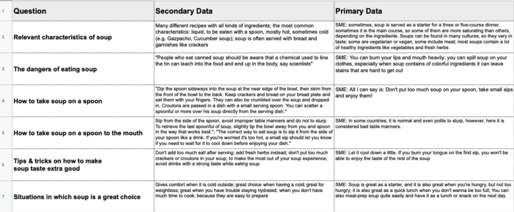

#+title: Technical Writing

* What is Technical Writing
** Characteristics of Technical Writing Documents

- They help people solve a problem
- They address a specific audience
- They use layout and structure to increase usability

** What is Technical Writing good for

- It helps making well-informed decision
- It reduces risks and prevents accidents
- It saves money by reducing support requests
- It helps users use and recommend a product
- It enhances product quality
- It pushed scientific progress by helping us comprehend technical processes

* What is good Technical Writing

** Correct
- All information should be correct
- All information should be honest
- Check your grammar, spelling, punctuation
- Check your language
  
** Complete
- Include all necessary information
- Choose your level of detail wisely
- Check for formal elements
  
** Usable
- Ensure readability and scanability
- Organize your content in logical chunks
- Choose a clear structure and layout
- Work with tags and links
  
** Clear
- Use clear and easy to understand language
- Avoid ambiguity and assign a clear meaning
- Use graphs and images if they can transfer meaning more effectively
- Use clear names for your chapters/headlines
  
** Concise
- Choose efficient grammar and syntax
- Choose short and simple words whenever possible
- Choose an efficient form of presentation
  
** Consistent
- Use a consistent naming system (e.g. headlines, chapter numbers)
- Use terminology in a consistent way
- Choose a consistent design for your document
- Use the standards of your organization and field

* The Writing Process

** Main obstacles in Technical Writing
- The fear of the blank page
- Being unsure about which topics to include or exclude
- The inability to tell whether out writing is good or bad
- Not knowing whether our writing is effective and helpful
- Not knowing how to improve our writing over time

** Use structured writing to overcome these obstacles
Follow a strict, linear, or circular process when producing a text document
- It helps us to start and finish writing our text document
- It helps us to ensure high quality and avoid mistakes
- It helps us to write efficiently

* Steps of the Writing Process
** Planning
- Define the purpose & audience of your document
- Characterize your target audience
- Define which topics to include and exclude
- Define the scope of the project
  
** Information collection & drafting
- Define the outline of your document
- Plan and conduct your research
- Analyze and structure your data
- Create the first draft of your text
  
** Revising & Editing
- Review your text based on formal quality criteria
- Double-check language, content, style
  
** Proofreading & Testing
- Have your document professionally proofread
- Design and run a user test or survey
- Adjust and improve your document accordingly
- Repeat process regularly

* Example

** Scenario
After kindergarten, your childhood friend Sarah moved to a remote island, where soup does not exist.
Returning to your neighborhood 15 years later, she is invited to a soup testing event.
In preparation for this event, she asks you for instructions on how to eat soup.

*** Our systematic approach
- Why is this task important?
- What needs to be done?
- How is it done?

** Planning
*** Define the purpose & audience of your document
**** Why is this task important?
- It helps you to identify the topics to include and exclude
- It helps you to choose the right medium
- It helps you to identify the right stakeholders
- It helps you to make decisions throughout the process
- It helps you to get started

**** What needs to be done
- Brainstorm about the purpose of your document and your target audience
- Boil down the purpose and the audience to one sentence

**** How is it done?
- Target audience is only Sarah
- Goal is to teach how to eat soup in a way she does not get hurt and does not spill soup on her clothes
- Give her a feeling of confidence with clear instructions

/Enable Sarah to eat soup safely and confidently/

*** Characterize your target audience
**** Why is this task important?
- It helps you to identify the topics to include and exclude
- It helps you to find the appropriate level of detail
- It helps you to define the right tone

**** What needs to be done?
- Write down all of your assumptions about your target audience
- Include your target audience's knowledge, needs, and preferences
- Write down all open questions you have about your audience
- Conduct qualitative research to answer your open questions

**** How is it done?
- Prior Knowledge
  - Has never eaten soup before or doesn't remember eating soup
  - Knows what soup is
  - She knows how to use dishes (incl. bowls)
  - She has eaten hot food before, but only solid hot food
  - Has only heard positives reviews of soup
  - Is only familiar with hot solid food
  - Does not know about the dangers of eating soup
  - Does not know how to use a spoon
- Needs & Fears
  - Is excited to try soup
  - Is not scared to try soup
- Context of Use
  - Will read the document before eating (and maybe while eating)
- Preferences
  - Short, easy to use instructions
  - Prefers text, but it should be as short as possible and easy to scan
  - Does not need instructions on how to cook soup or serve soup

*** Define which topics to include and exclude

**** Why is this task important?
- It helps you to make your document effective and helpful
- It helps you to make your document efficient
- It helps you to keep your research efficient

**** What needs to be done?
- Collect all the information that your audience needs in order for your document to fulfill its purpose
- Collect all the information that your audience does not need

**** How is it done?
- Topics to include
  - The dangers of eating soup (spilling; burning her lip / tongue)
  - How to eat soup with a spoon
  - How to take soup on a spoon
  - How to take soup on a spoon to the mouth
  - Special tips & tricks on how to make soup taste extra good
  - Situations in which soup is a great choice
  - Relevant characteristics of soup
- Topics to Exclude
  - Irrelevant characteristics of soup
  - Different kinds of soup
  - How to cook soup
  - How to serve soup
    
*** Define the scope of the project

**** Why is this task important?
- It helps you to plan the resources for getting your doc finished
- It helps you to manage the resources throughout the process
- It helps to set realistic expectation for stakeholders

**** What needs to be done?
- Plan the tasks from start to finish
- Plan how much time each task needs
- Plan who needs to be involved in each task
- Create a timeline

**** How is it done?
- Planning
  - Time needed: 1.5h
  - People involved: me, Sarah
- Information Collection & Drafting
  - Time needed: 2.5h
  - People involved: me, Marc
- Revising & Editing
  - Time needed: 1.0h
  - People involved: me
- Proofreading & Testing
  - Time needed: 1.5h
  - People involved: me, Marc, Sarah

|                                   | Mo | Teu | Wed | Thu | Fri | Sat | Sun |
|-----------------------------------+----+-----+-----+-----+-----+-----+-----|
| Planning                          | X  |     |     |     |     |     |     |
| Information Collection & Drafting |    | X   | X   | X   |     |     |     |
| Revising & Editing                |    |     |     |     | X   |     |     |
| Proofreading & Testing            |    |     |     |     |     | X   | X   |
  
** Information collection & drafting
*** Define the outline of your document
**** Why is this task important?
- It helps you to define the structure of your document
- It helps you to find the logical connection between the topics to cover
- It helps you to start writing
  
**** What needs to be done?
- Put the topics you want to include into a logical order
  
**** How is it done?
- Relevant characteristics of soup
- The dangers of eating soup (spilling; burning her lip / tongue)
- How to take soup on a spoon
- How to take soup on a spoon to the mouth
- Special tips & tricks on how to make soup taste extra good
- Situations in which soup is a great choice

*** Plan and conduct your research
**** Why is this task important?
- Research is necessary to collect all the valid knowledge your need
  
**** What needs to be done?
- Secondary data: plan which material to consult (existing documents, brochures, notes etc.)
- Primary data: plan who to consult and how
- Plan the realization of the research project
- Educate yourself on research methods or consult research experts
**** How is it done?
Interview with SME
- What do you consider relevant characteristics of soup for someone who wants to learn how to eat it?
- What do you consider risks and dangers of eating soup?
- How does a person best get soup on a spoon?
- How does a person best take soup to their mouth and eat it?
- Do you have any special tips & tricks on how to make soup taste extra good?
- In which situation is soup a great choice?
  
*** Analyze and structure your data
**** Why is this task important?
- It will prevent you from writing based on false assumptions
- It prevents you from missing any information
- It will save you time
  
**** What needs to be done?
- For primary data: Collect all data in form of text
- For secondary data: Put your new knowledge in text form
- Categorize the knowledge according to your outline
**** How is it done?

*** Create the first draft of your text
**** Why is this task important?
- It's easier to sculpt an existing draft into something perfect than to write something perfect on a blank page
#+begin_quote
Until you've done your first draft, you have no idea what you're writing. You have to quarry the stone before you can start to sculpt it
#+end_quote
**** What needs to be done?
- Write out the knowledge that you have gathered
- Proceed section by section
- Keep in mind: it's only a first draft!
**** How is it done?
** Revising & Editing
*** Review your text based on formal quality criteria
**** Why is this task important?
- It helps you to turn your first draft into a final draft
- It helps you to ensure the quality of your document according to formal standards
  
**** What needs to be done
- Get an overview of the most important quality criteria
- Review your document step by step
  
**** How is it done?
*** Double-check language, content, style
**** Why is this task important?
**** What needs to be done
**** How is it done?
** Proofreading & Testing
*** Have your document professionally proofread
**** Why is this task important?
**** What needs to be done
**** How is it done?
*** Design and run a user test or survey
**** Why is this task important?
**** What needs to be done
**** How is it done?
*** Adjust and improve your document accordingly
**** Why is this task important?
**** What needs to be done
**** How is it done?
*** Repeat process regularly
**** Why is this task important?
**** What needs to be done
**** How is it done?
